# Google-map-dynamic-routing — Frontend

> Creating a web/app like Google Maps which shows the route from source to destination with real-time calculation of how many people are taking the same route and dynamically adjusts the path.

---

## Frontend Panels

### Theme System
- **Dual theme**: Light ☀️ + Dark 🌙 with toggle on every panel
- **Light mode**: White background, subtle shadows, standard map tiles, blue/green accents
- **Dark mode**: Charcoal `#1A1A2E`, glassmorphism panels, night-mode map, neon cyan/emerald accents
- **Toggle button**: Moon 🌙 in light → Sun ☀️ in dark. Rotates 180° on toggle. Saved to localStorage. Auto-detects `prefers-color-scheme` on first visit.

---

### Panel 1 — Register
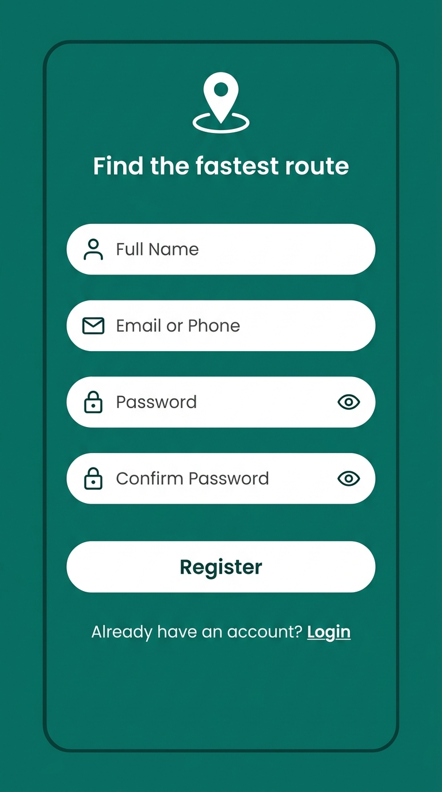

---

### Panel 2 — Login
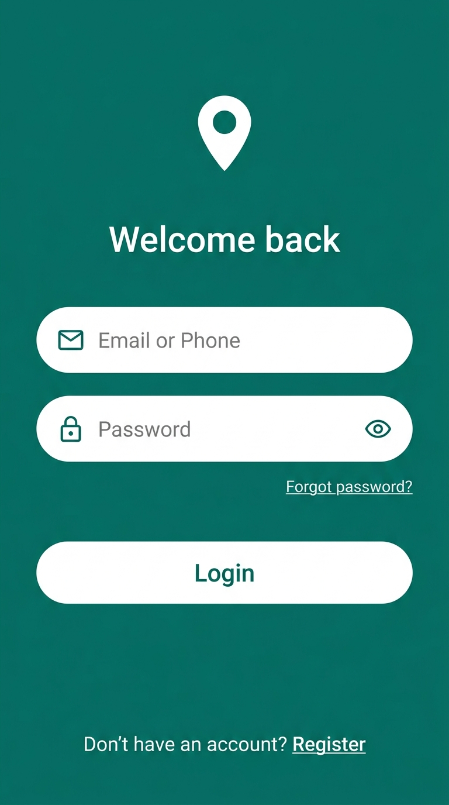

---

### Panel 3 — OTP Verification
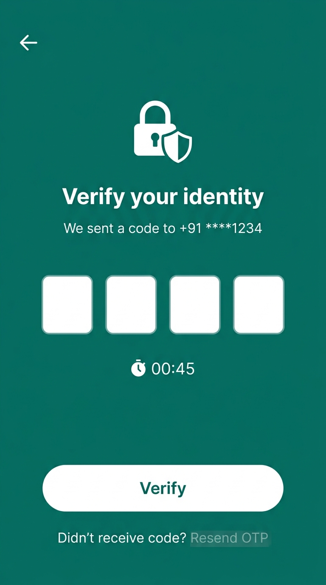

---

### Panel 4 — 🏠 Home / Explore
- Full-screen map with search bar at top
- Category chips: Restaurants, Gas, Coffee, Hotels, Groceries
- Nearby places shown on map
- **Crowd features**: Crowd heatmap toggle, "X users routing nearby"

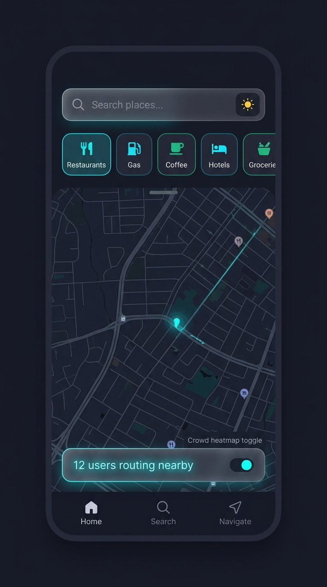

---

### Panel 5 — 📋 Suggestions / Results
- Shows nearby places after tapping a category chip
- Map with color-coded pins (🟢 green / 🟡 yellow / 🔴 red) + scrollable result cards
- **Crowd features**: "X users heading here", "🔥 Trending" badge, "🟢 Quiet now"

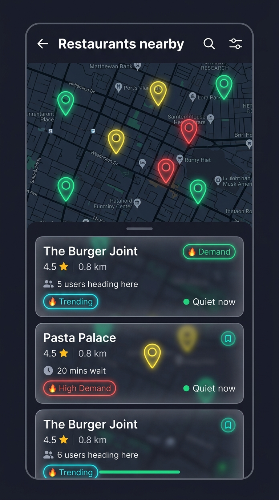

---

### Panel 6 — 🔍 Search
- Uber/Ola-style fullscreen search
- Source (current location or type) + Destination
- Recent searches + Saved places + Autocomplete suggestions

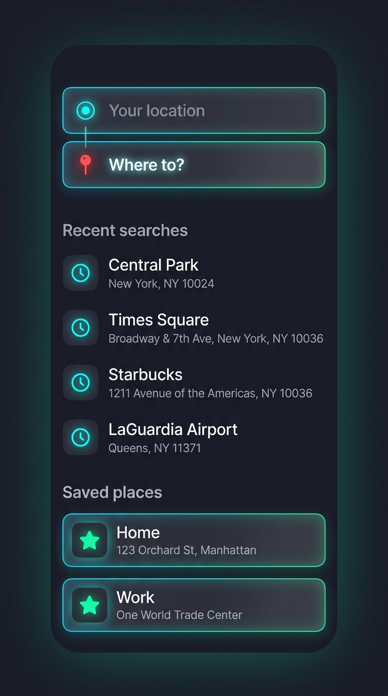

---

### Panel 7 — 🚗 Mode Selection
- Transport mode selector: 🚗 Car, 🚲 Bike, 🚌 Bus, 🚶 Walk
- Shown before/during route planning

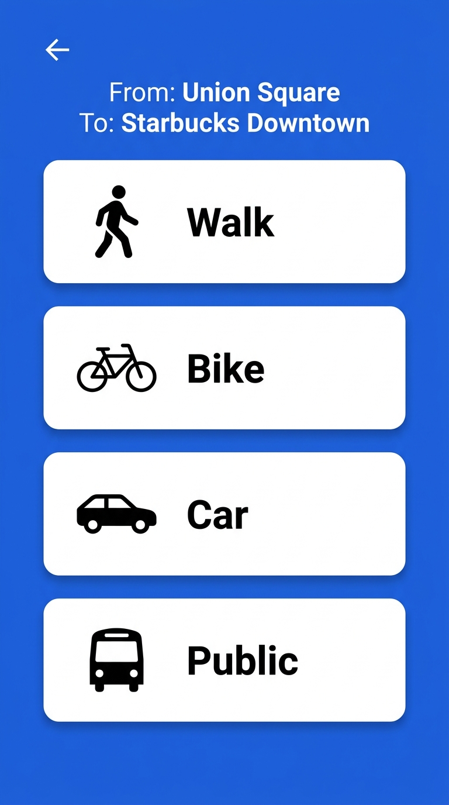

---

### Panel 8 — 🗺️ Route Planning
- Multiple route options with crowd comparison on map (Source → Destination)
- Color-coded routes: 🟢 low crowd, 🟡 moderate, 🔴 high
- **Crowd features**: "X users on route", crowd density bars, "Recommended" badge

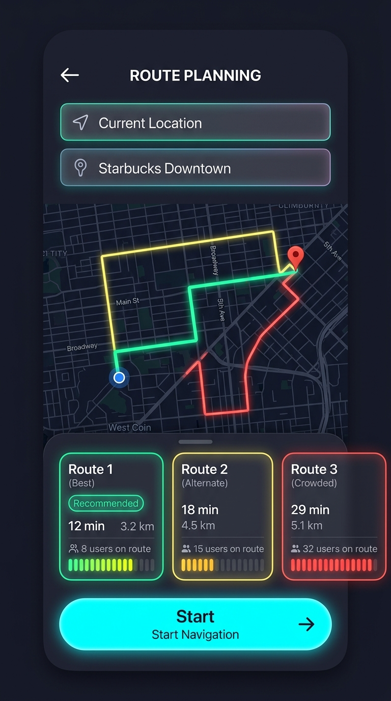

---

### Panel 9 — 🧭 Active Navigation
- Turn-by-turn live navigation with crowd awareness
- **Crowd features**: "X users ahead" badge, "Faster route found" re-routing toast, live crowd indicator (Low / Moderate / High)

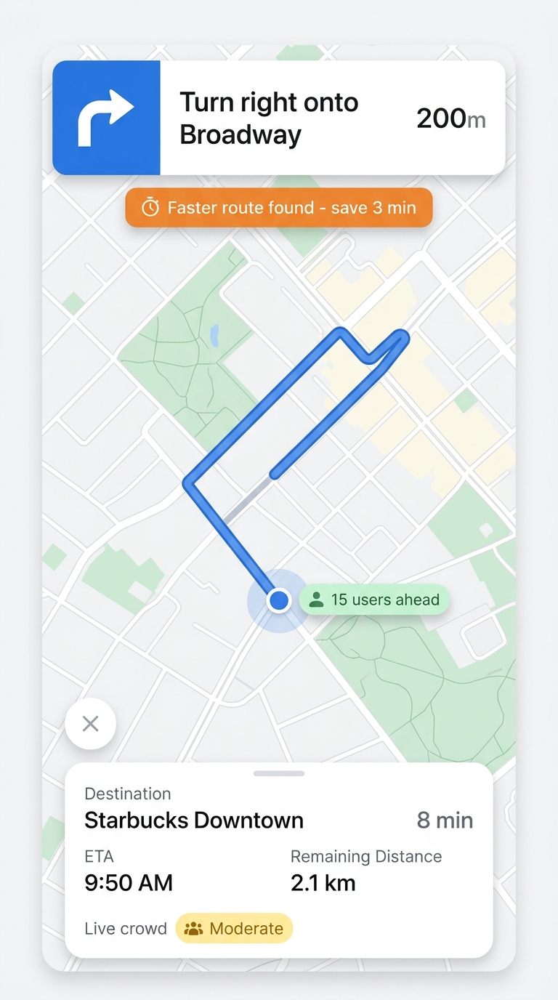

---

### Panel 10 — 📄 Place Details
- Place info page: hero image, rating, reviews, tabs
- "You've arrived!" popup when reached via navigation
- **Crowd features**: "X users heading here right now", "🟢 Quiet now — no wait expected"

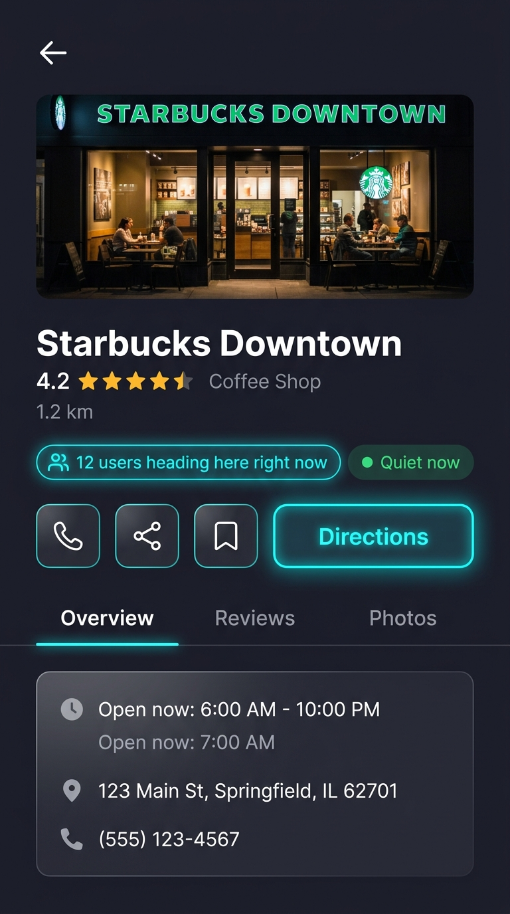

---

### Panel 11 — ⚙️ Settings
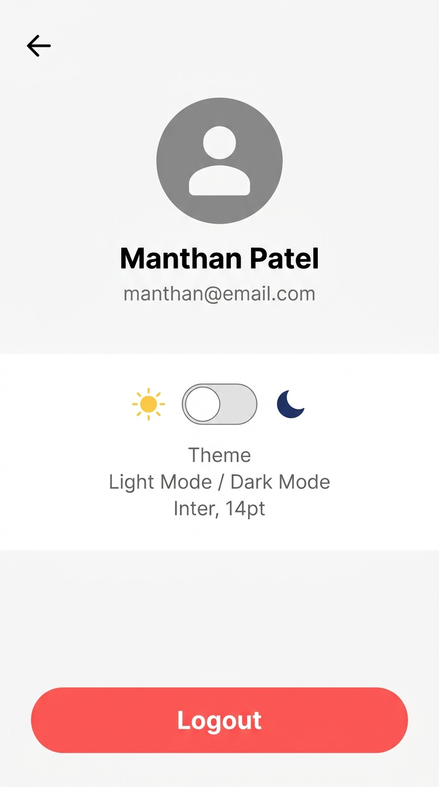

---

## User Flows

**Flow 1 — Suggestions:**
```
🏠 Home → tap chip → 📋 Suggestions → tap card → 📄 Place Detail
→ "Directions" → 🗺️ Route Planning → "Start" → 🧭 Navigation → arrived → 📄 Place Detail
```

**Flow 2 — Direct search:**
```
🏠 Home → tap search → 🔍 Search (source + dest)
→ 🗺️ Route Planning → "Start" → 🧭 Navigation → arrived → 📄 Place Detail
```

**Browse loop:**
```
📋 Suggestions → tap card → 📄 Place Detail → ← back → 📋 Suggestions → tap different card → repeat
```

---

## Navigation System

| Action | Behavior |
|--------|----------|
| **Tap ← (back)** | Goes one step back to previous panel |
| **Hold ← (1.5s)** | Jumps to 🏠 Home. Shows circular progress ring. Forward arrow (→) appears on Home |
| **→ (forward on Home)** | Returns to panel before long-press. State preserved. Disappears on new action |
| **"Exit" (Navigation only)** | Goes to Home. No forward arrow (deliberate exit) |
| **← on Place Detail after arrival** | Goes to Home (flow complete) |
| **First-time tooltip** | "Hold ← to return Home" shown once |

### Place Detail — Entry Points
- **From Suggestions** (tapping card) → ← goes back to Suggestions
- **From Arrival** (navigation ended) → ← goes to Home

### Resolved Behaviors
- **"Start" vs "Directions"** on Place Detail: "Start" = auto-pick best route & navigate. "Directions" = show Route Planning with all options.
- **"Start" after arrival**: Changes to "Navigate Again"
- **Transport modes**: 🚗 Car, 🚲 Bike, 🚌 Bus, 🚶 Walk selector included in Route Planning panel
